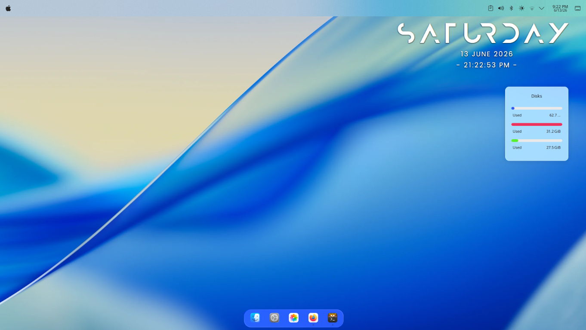
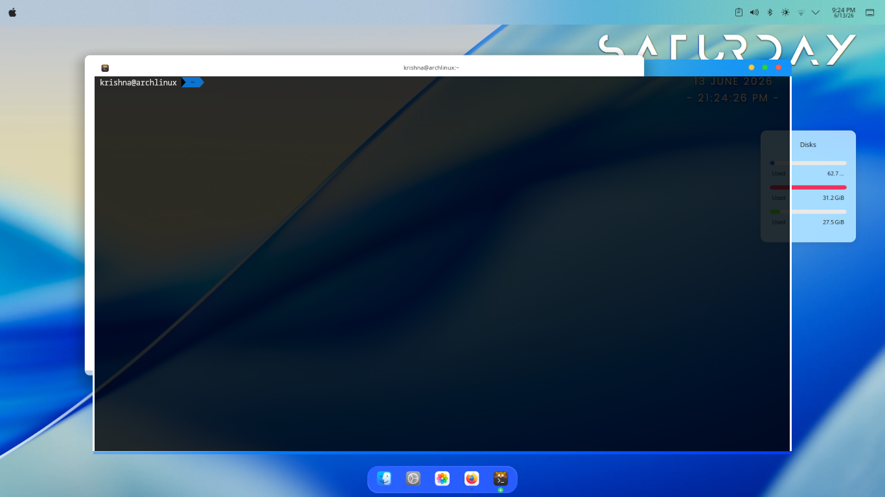

<h2>Desktop Preview</h2>

<p align="center">
  
  
</p>


# Amar Mac

My personal Arch Linux + KDE Plasma workstation.

## Desktop Preview

### Main Desktop


### Kitty Terminal Setup


## Features

- Arch Linux
- KDE Plasma
- Kitty Terminal
- Zsh + Oh My Zsh
- GitHub Backup
- Java Development
- Python Development

## Installation

```bash
git clone git@github.com:AmarSwarnkar/amar-mac.git
cd amar-mac
./install.sh
```

## Included

- KDE configuration
- Kitty configuration
- Package lists
- Installation script
